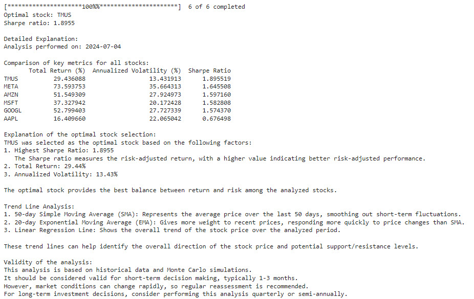
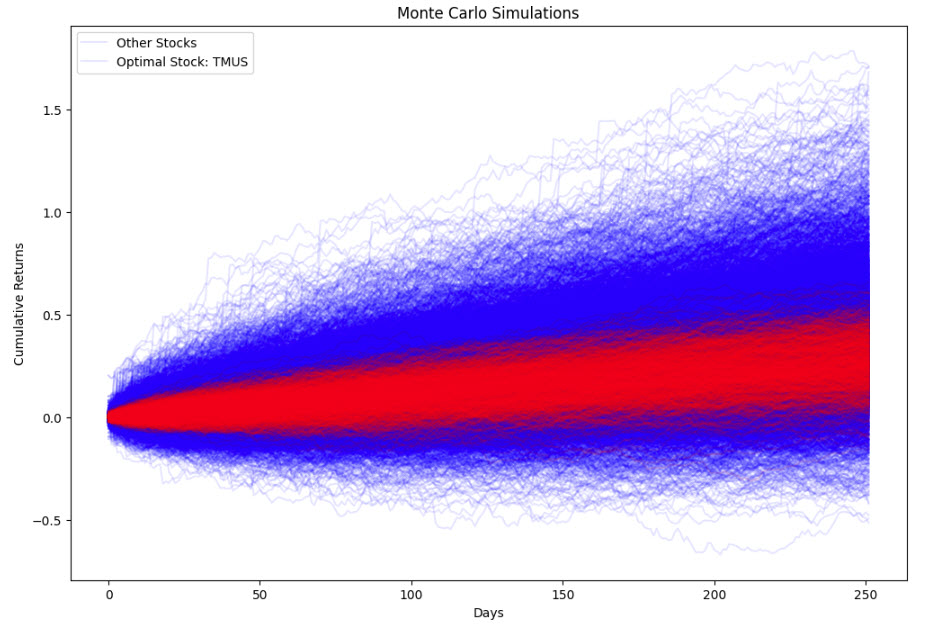
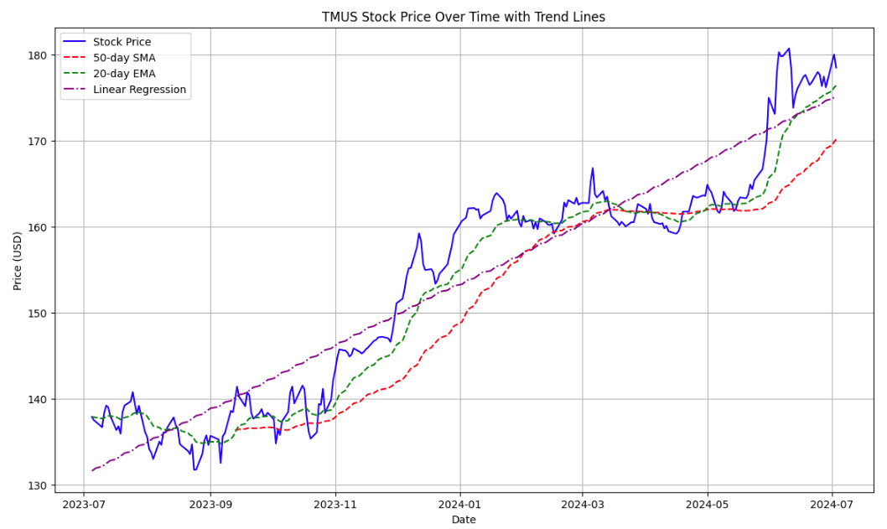

# Stock Portfolio Optimizer

## Overview
This Python script performs a comprehensive analysis of a stock portfolio using historical data, Monte Carlo simulations, and various financial metrics. It aims to identify the optimal stock from a given portfolio based on risk-adjusted returns.

## Motivating Articles

Zhang, A. (2023). Portfolio Optimization of Stocks–Python-Based Stock Analysis. International Journal of Education and Humanities, 9(2), 32-38.

Wang, Y., Yang, N. Y., & Zhao, Q. (2023, February). Application of Monte Carlo Simulation in Calculating the Maximum Sharpe Ratio Based on American Funds. In Proceedings of the 4th International Conference on Economic Management and Model Engineering, ICEMME 2022, November 18-20, 2022, Nanjing, China.

## Features
- Fetches historical stock data from Yahoo Finance
- Performs Monte Carlo simulations for future stock price predictions
- Calculates key financial metrics including Sharpe Ratio and volatility
- Identifies the optimal stock based on the highest Sharpe Ratio
- Provides trend line analysis using SMA, EMA, and Linear Regression
- Generates visualizations of Monte Carlo simulations and stock price trends

## Dependencies
- yfinance
- pandas
- numpy
- matplotlib
- scipy

## Usage
1. Install the required dependencies:
2. The script will analyze a predefined list of stocks (AAPL, GOOGL, MSFT, AMZN, META, TMUS) over the past year.
3. Results will be displayed in the console and plots will be shown.

## Customization
- To analyze different stocks, modify the `tickers` list in the `main()` function.
- Adjust the analysis period by changing `start_date` and `end_date` in the `main()` function.
- Modify the number of Monte Carlo simulations by changing `num_simulations` in the `main()` function.

## Output
The script provides:
1. A detailed explanation of the optimal stock selection

3. A plot of Monte Carlo simulations for all stocks

4. A plot of the optimal stock's price history with trend lines

## Importance of Analysis Techniques

### Monte Carlo Simulation
Monte Carlo simulations are crucial in financial analysis as they:
- Model the probability of different outcomes in a process that cannot easily be predicted due to the intervention of random variables.
- Help in understanding the impact of risk and uncertainty in prediction and forecasting models.
- Provide a range of possible outcomes and the probabilities they will occur for any choice of action.

### Sharpe Ratio
The Sharpe Ratio is a key metric in portfolio analysis because it:
- Measures the performance of an investment compared to a risk-free asset, after adjusting for its risk.
- Helps investors understand the return of an investment compared to its risk.
- Allows for comparison between different investments on a risk-adjusted basis.

### Volatility
Understanding volatility is crucial in stock analysis as it:
- Measures the dispersion of returns for a given security or market index.
- Indicates the level of risk associated with price changes of a security.
- Helps in assessing the potential for large swings in a stock's price.

### Trend Line Analysis
Trend line analysis, including SMA, EMA, and Linear Regression, is important because it:
- Helps identify the overall direction of a stock's price movement.
- Can indicate potential support and resistance levels.
- Assists in making informed decisions about entry and exit points for trades.

### Optimal Stock Selection
Selecting an optimal stock from a portfolio is crucial as it:
- Maximizes the potential for returns while minimizing risk.
- Helps in efficient allocation of investment resources.
- Can lead to better overall portfolio performance.

## License
Distributed under the MIT License. See `LICENSE` for more information.

## Disclaimer
This tool is for educational and informational purposes only. It should not be considered financial advice. Always conduct your own research and consider seeking advice from a qualified financial professional before making investment decisions.
